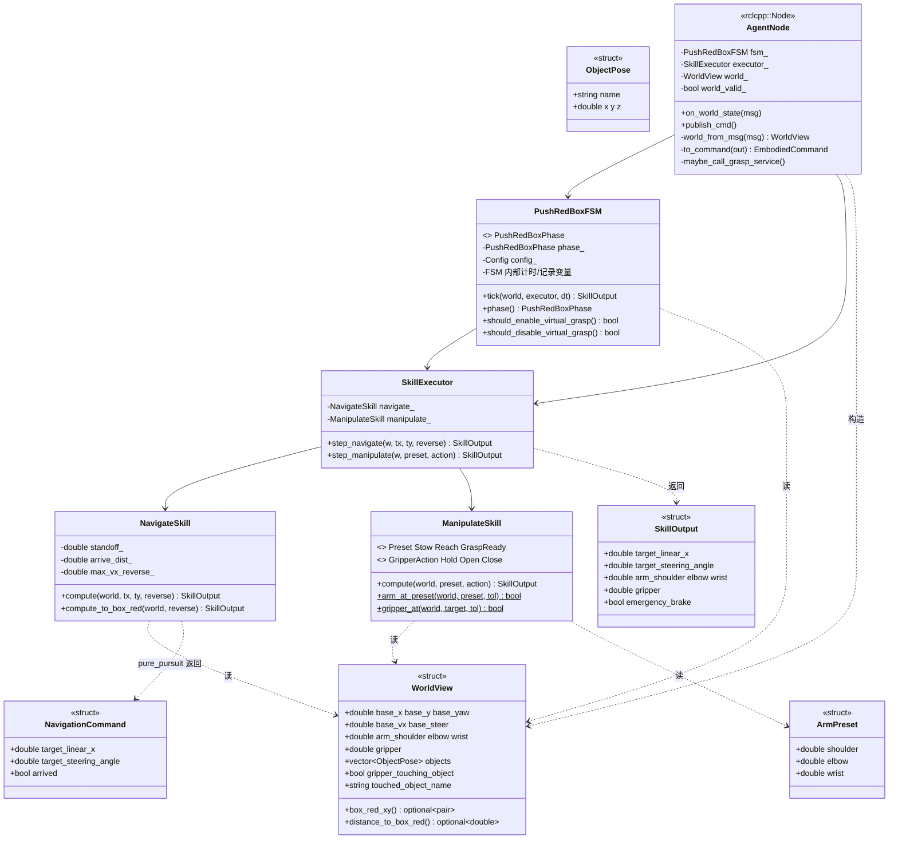
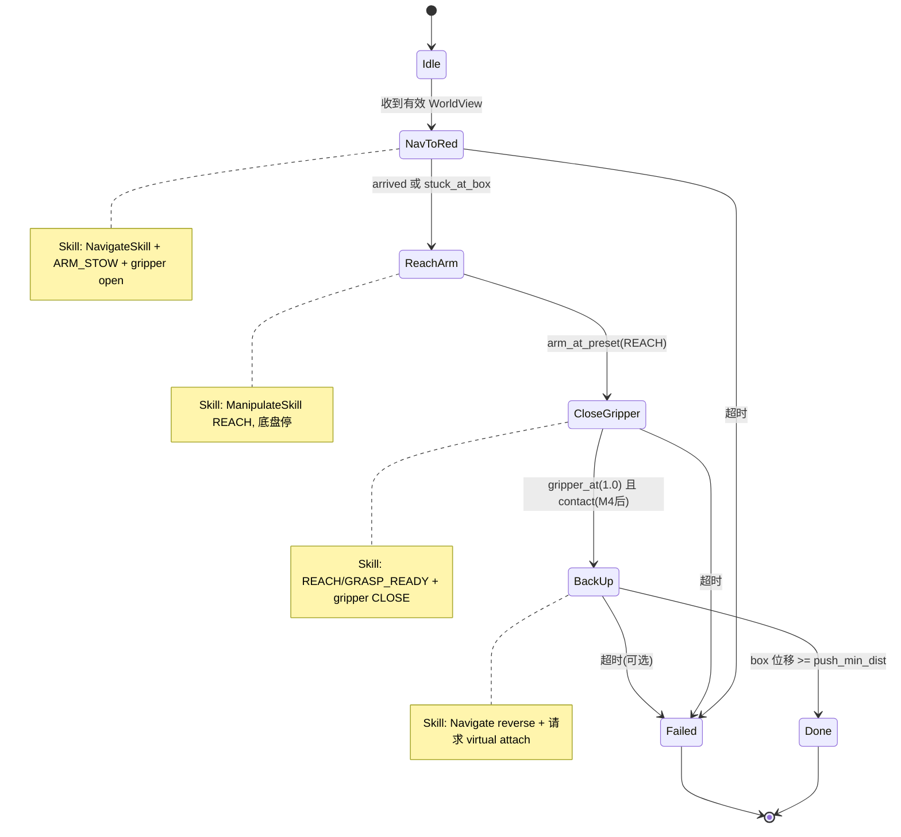

# 第二期类图与接口说明（C++ 路径）

> **用途**：对照本文理解每个类/函数的职责，**自己再画一版**（纸笔 / draw.io / Mermaid 均可）。  
> **关联**：[PHASE2_CPP_IMPLEMENTATION_GUIDE.md](./PHASE2_CPP_IMPLEMENTATION_GUIDE.md)

---

## 1. 分层总览

```
┌─────────────────────────────────────────────────────────┐
│  chassis_agent_cpp::AgentNode     ← ROS 壳（有 rclcpp）   │
│    消息转换、定时器、service 客户端                        │
└──────────────────────────┬──────────────────────────────┘
                           │ 只传 WorldView / SkillOutput
┌──────────────────────────▼──────────────────────────────┐
│  embodied_core                      ← 纯 C++（无 ROS）    │
│    PushRedBoxFSM → SkillExecutor → Navigate/Manipulate  │
│    WorldView, pure_pursuit, ArmPreset                     │
└─────────────────────────────────────────────────────────┘
```

**原则**：算法和状态机 **不知道** ROS 存在；`AgentNode` **不写**导航公式、**不写**状态转移表。

---

## 2. 类关系图（Mermaid）



---

## 3. FSM 状态图



---

## 4. 数据结构（非类，但必须有）

### 4.1 `ArmPreset`

| 作用 | 三个关节角的命名常量组，避免魔法数字散落。 |
|------|---------------------------------------------|

| 成员 | 含义 |
|------|------|
| `shoulder`, `elbow`, `wrist` | 弧度，与 `EmbodiedCommand` / `/world_state` 同单位 |

| 常量 | 值 | 用途 |
|------|-----|------|
| `kArmStow` | 0.35, 0.0, 0.25 | 移动、默认 |
| `kArmReach` | 0.55, 0.4, 0.3 | 伸向红箱 |
| `kArmGraspReady` | 0.45, 0.6, 0.2 | 抓取准备（可选） |

---

### 4.2 `ObjectPose`

| 作用 | `WorldView` 里单个物体的名字 + 位置（第二期主要用 `box_red`）。 |

| 成员 | 含义 |
|------|------|
| `name` | 如 `"box_red"` |
| `x`, `y`, `z` | 世界坐标 [m] |

---

### 4.3 `WorldView`

| 作用 | **FSM 和 Skill 唯一使用的观测类型**；从 `EmbodiedWorldState` 转换，与 ROS 解耦。 |

| 成员 | 含义 |
|------|------|
| `base_x`, `base_y`, `base_yaw` | 底盘位姿 |
| `base_vx`, `base_steer` | 底盘实际速度 / 转向（stuck 判据用） |
| `arm_*`, `gripper` | 机械臂实际状态（到位判据用） |
| `objects` | 场景中物体列表 |
| `gripper_touching_object` | 是否检测到接触（M4 后由仿真填入） |
| `touched_object_name` | 接触物体名，如 `"box_red"` |

| 方法 | 作用 |
|------|------|
| `box_red_xy()` | 在 `objects` 里找 `box_red`，返回 `(x,y)`；找不到返回 `nullopt` |
| `distance_to_box_red()` | 底盘到红箱中心的平面距离 [m]；无 box 返回 `nullopt` |

**谁构造**：仅 `AgentNode::world_from_msg()`（或同文件自由函数）。  
**谁使用**：FSM、NavigateSkill、ManipulateSkill；**不**在 Skill 里解析 ROS msg。

---

### 4.4 `NavigationCommand`

| 作用 | `pure_pursuit()` 的返回值，仅表示底盘导航结果。 |

| 成员 | 含义 |
|------|------|
| `target_linear_x` | 目标线速度 [m/s]，前进为正 |
| `target_steering_angle` | 目标前轮角 [rad] |
| `arrived` | 是否已进入 `arrive_dist` 范围内 |

---

### 4.5 `SkillOutput`

| 作用 | 一个 Skill 或 FSM 一帧的 **完整控制意图**，可映射为 `EmbodiedCommand`。 |

| 成员 | 含义 |
|------|------|
| `target_linear_x`, `target_steering_angle` | 底盘 |
| `arm_shoulder`, `arm_elbow`, `arm_wrist` | 关节目标 [rad] |
| `gripper` | 0=开，1=合 |
| `emergency_brake` | 急停（第二期一般 false） |

---

## 5. 自由函数

### 5.1 `pure_pursuit(...)`

| 项目 | 说明 |
|------|------|
| **作用** | Pure Pursuit 几何导航：给定当前位姿和目标点，算本帧 `vx` 和 `steer`。 |
| **输入** | `x,y,yaw` 当前位姿；`target_x,target_y` 目标；可选 `arrive_dist` 等 |
| **输出** | `NavigationCommand` |
| **移植源** | `chassis_agent/navigation.py` 同名函数 |
| **谁调用** | 仅 `NavigateSkill`（不要 FSM 直接调） |

---

### 5.2 `stuck_at_box(world, cmd_vx)`（自由函数或 FSM 私有）

| 项目 | 说明 |
|------|------|
| **作用** | 判断「命令在走但实际动不了且离箱很近」→ 视为到达，避免顶箱卡住。 |
| **移植源** | `agent_node.py` 的 `_stuck_at_box` |
| **谁调用** | `PushRedBoxFSM` 在 `NavToRed` 态 |

---

## 6. 技能类

### 6.1 `NavigateSkill`

| 项目 | 说明 |
|------|------|
| **类作用** | **导航技能**：把「去哪」变成底盘 `vx/steer`，不管机械臂。 |
| **不负责** | 状态切换、夹爪、接触、ROS |

| 成员（配置） | 含义 |
|--------------|------|
| `standoff_` | 停在目标前多远 [m]，默认 0.35 |
| `arrive_dist_` | Pure Pursuit 到达半径 [m] |
| `max_vx_reverse_` | 倒车最大速度 [m/s]（M6 用） |

| 方法 | 作用 |
|------|------|
| `compute(world, target_x, target_y, reverse)` | 导航到任意世界坐标；`reverse=true` 时倒车（M6） |
| `compute_to_box_red(world, reverse)` | 便捷：目标 = `box_red` 前 `standoff`；无 box 时用 fallback `(2.15, 0)` |

| 返回 | `SkillOutput`：填 `target_linear_x/steer`；臂字段由调用方或 Executor 补默认 |

---

### 6.2 `ManipulateSkill`

| 项目 | 说明 |
|------|------|
| **类作用** | **操作技能**：臂姿预设 + 夹爪，底盘速度置 0。 |
| **不负责** | 导航、FSM 时序 |

| 枚举 `Preset` | 对应 `ArmPreset` |
|---------------|------------------|
| `Stow` | `kArmStow` |
| `Reach` | `kArmReach` |
| `GraspReady` | `kArmGraspReady` |

| 枚举 `GripperAction` | `gripper` 输出 |
|----------------------|----------------|
| `Open` | 0.0 |
| `Close` | 1.0 |
| `Hold` | 保持 `world.gripper` 或上一目标 |

| 方法 | 作用 |
|------|------|
| `compute(world, preset, action)` | 输出一帧臂 + 夹爪 + 零速底盘 |
| `arm_at_preset(world, preset, tol)` **static** | 实际关节是否接近预设（FSM 切换用） |
| `gripper_at(world, target, tol)` **static** | 夹爪是否到位（如 `>0.95`） |

---

### 6.3 `SkillExecutor`

| 项目 | 说明 |
|------|------|
| **类作用** | **技能组合器**：FSM 不直接 new 两个 Skill，只调 Executor 的两条入口。 |
| **价值** | FSM 代码更短；以后加 `AlignSkill` 只改 Executor。 |

| 成员 | 含义 |
|------|------|
| `navigate_` | 持有的 `NavigateSkill` 实例 |
| `manipulate_` | 持有的 `ManipulateSkill` 实例 |

| 方法 | 作用 |
|------|------|
| `step_navigate(w, tx, ty, reverse)` | 转调 `navigate_.compute(...)`，返回 `SkillOutput` |
| `step_manipulate(w, preset, action)` | 转调 `manipulate_.compute(...)` |

**FSM 每帧只应通过 Executor 调 Skill**，不要 FSM 同时持有 Skill 指针又绕过 Executor（除非你想简化 M3，Executor 也可内联，但结构略差）。

---

## 7. 状态机类

### 7.1 `PushRedBoxPhase`（enum）

| 值 | 含义 |
|----|------|
| `Idle` | 等待第一帧有效观测 |
| `NavToRed` | 导航到红箱 standoff |
| `ReachArm` | 停车，切 REACH 臂姿 |
| `CloseGripper` | 闭合夹爪，等接触 |
| `BackUp` | 倒车推箱 |
| `Done` | 任务成功 |
| `Failed` | 超时等失败 |

---

### 7.2 `PushRedBoxFSM`

| 项目 | 说明 |
|------|------|
| **类作用** | **任务编排**：按阶段调用 Executor，检查判据，打日志，驱动 virtual grasp 标志。 |
| **不负责** | ROS 订阅/发布、MuJoCo、pure_pursuit 公式 |

| 内部状态（示例） | 作用 |
|------------------|------|
| `phase_` | 当前阶段 |
| `phase_enter_time_` | 进入当前阶段的时间（超时） |
| `box_x0_, box_y0_` | 进入 `BackUp` 时红箱位置（算推箱位移） |
| `back_start_x_, back_start_y_` | 进入 `BackUp` 时底盘位置 |
| `grasp_requested_` | 是否已请求 attach（避免重复调 service） |

| 方法 | 作用 |
|------|------|
| `tick(world, executor, dt)` | **核心**：根据 `phase_` 调 Executor → 得到本帧 `SkillOutput`；检查转移条件；可能 `transition()` |
| `phase()` | 供 Agent 打日志或 UI |
| `should_enable_virtual_grasp()` | 进入 `BackUp` 后为 true，Agent 调 `/sim/set_virtual_grasp` |
| `should_disable_virtual_grasp()` | `Done`/`Failed` 后为 true，解除 attach |
| `transition(next, reason)` **private** | 改 `phase_`，打 `FSM A -> B: reason` 日志 |

| `tick` 各阶段行为摘要 |

| 阶段 | 调用 | 退出条件 |
|------|------|----------|
| `Idle` | 零输出 | `world` 有效 |
| `NavToRed` | `step_navigate` → box standoff + Stow + Open | `arrived` 或 `stuck_at_box` |
| `ReachArm` | `step_manipulate(REACH, HOLD)` | `arm_at_preset(REACH)` |
| `CloseGripper` | `step_manipulate(REACH, CLOSE)` | `gripper_at(1.0)` && contact（M4） |
| `BackUp` | `step_navigate(..., reverse=true)` + Stow | box 位移 ≥ `push_min_dist` |
| `Done` | 零速 Stow | — |

---

## 8. ROS 节点类

### 8.1 `AgentNode`（`chassis_agent_cpp`）

| 项目 | 说明 |
|------|------|
| **类作用** | **唯一有 ROS 的类**：收消息、转 `WorldView`、调 FSM、发 `EmbodiedCommand`、调 grasp service。 |
| **不负责** | 导航算法、FSM 转移逻辑 |

| 成员 | 作用 |
|------|------|
| `fsm_` | `PushRedBoxFSM` |
| `executor_` | `SkillExecutor` |
| `world_` | 最新 `WorldView` |
| `world_valid_` | 是否收到过 `/world_state` |
| `pub_`, `sub_`, `timer_` | rclcpp 通信 |
| `grasp_client_` | M5：`SetVirtualGrasp` 客户端 |

| 方法 | 作用 |
|------|------|
| `on_world_state(msg)` | 回调：更新 `world_`、`world_valid_` |
| `publish_cmd()` | 定时器 20ms：`out = fsm_.tick(...)` → `to_command(out)` → publish |
| `world_from_msg(msg)` | `EmbodiedWorldState` → `WorldView`（字段一一拷贝 + 解析 objects） |
| `to_command(out)` | `SkillOutput` → `EmbodiedCommand` |
| `maybe_call_grasp_service()` | 若 `fsm_.should_enable/disable_virtual_grasp()` 则 async 调 service |

**参考模板**：`chassis_controller/src/controller_node.cpp` 的 publisher + timer 写法。

---

## 9. Python 仿真侧（第二期只改函数，不必画成 C++ 类）

| 符号 | 作用 |
|------|------|
| `read_gripper_position(model, data)` | MuJoCo 读 gripper body 的 x,y,z |
| `detect_gripper_contact(model, data)` | 距离 heuristic → `(bool, object_name)` |
| `VirtualGraspState` | 是否 attach、物体名、offset |
| `begin_virtual_grasp(...)` | 记录 gripper–box 偏移 |
| `apply_virtual_grasp(...)` | 每步写回 box 的 freejoint qpos |
| `simulation_node` service callback | 响应 C++ 的 enable/disable attach |

---

## 10. 一帧数据流（帮助你对齐类职责）

```
/world_state (ROS)
    │
    ▼
AgentNode::world_from_msg()  ──►  WorldView
    │
    ▼
PushRedBoxFSM::tick(world, executor, dt)
    │  根据 phase 决定
    ├─► SkillExecutor::step_navigate / step_manipulate
    │       └─► NavigateSkill / ManipulateSkill
    │               └─► pure_pursuit (仅导航)
    │
    ▼
SkillOutput
    │
    ▼
AgentNode::to_command()  ──►  EmbodiedCommand  ──►  /control_cmd
    │
    ▼ (M5, BackUp 阶段)
SetVirtualGrasp service  ──►  simulation_node  ──►  sim_step attach
```

---

## 11. 文件与类对应表

| 头文件 | 主要内容 |
|--------|----------|
| `arm_preset.hpp` | `ArmPreset`, `kArmStow/Reach/GraspReady` |
| `world_view.hpp` | `ObjectPose`, `WorldView` + 方法实现 |
| `navigation.hpp` | `NavigationCommand`, `pure_pursuit()` |
| `skill_output.hpp` | `SkillOutput` |
| `navigate_skill.hpp/.cpp` | `NavigateSkill` |
| `manipulate_skill.hpp/.cpp` | `ManipulateSkill` |
| `skill_executor.hpp/.cpp` | `SkillExecutor` |
| `push_red_box_fsm.hpp/.cpp` | `PushRedBoxPhase`, `PushRedBoxFSM`, `stuck_at_box` |
| `agent_node.cpp` | `AgentNode`, `world_from_msg`, `main` |

---

## 12. 自己画图时的检查清单

- [ ] `embodied_core` 里没有 `#include <rclcpp/...>`
- [ ] FSM 不直接调用 `pure_pursuit`
- [ ] 只有 `AgentNode` 认识 `EmbodiedWorldState` / `EmbodiedCommand`
- [ ] `WorldView` 是 FSM/Skill 共用的观测类型
- [ ] 状态图画了 6 个主态 + Failed + 每态用的 Skill
- [ ] M5 标出 `AgentNode` → service → `simulation_node` 的虚线

---

**文档版本**：v1.0  
**下一步**：对照 [PHASE2_CPP_IMPLEMENTATION_GUIDE.md §5 M2](./PHASE2_CPP_IMPLEMENTATION_GUIDE.md) 从 `arm_preset.hpp` + `navigation.cpp` 开始实现。
