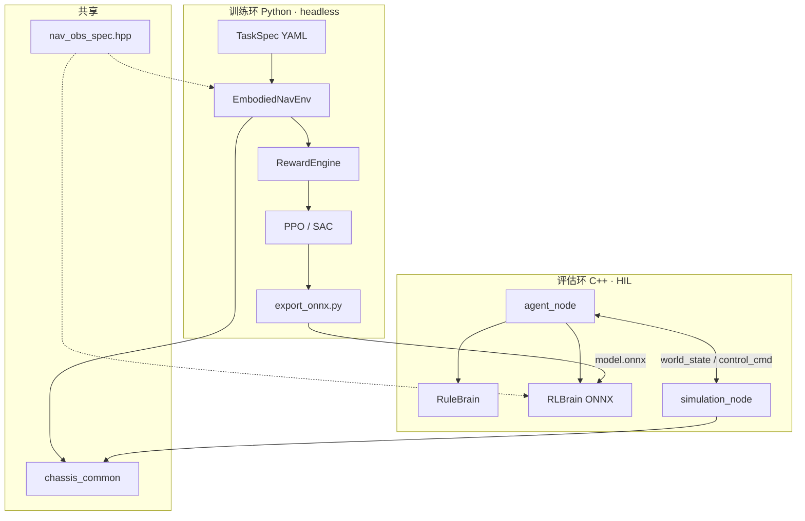
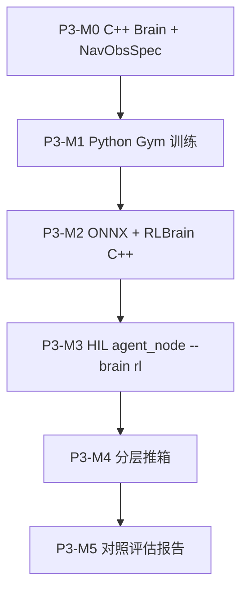

# 第三期：仿真自主学习 — 规划与架构设计

> **定位**：在 MuJoCo HIL 中接入可学习的大脑，**不上真机**。  
> **原则**：规划不写死在 FSM 里，FSM 降级为 **Teacher / Baseline**；学习成为一等公民。  
> **语言**：**训练用 Python，契约与推理用 C++**（仿真期即对齐 C++，不另起 Python Agent 分叉）。  
> **关联**：[BRAIN_ROADMAP.md](./BRAIN_ROADMAP.md) · [PHASE2_CLASS_DIAGRAM.md](./PHASE2_CLASS_DIAGRAM.md)

---

## 1. 设计命题

第二期回答了：「身体和控制链是否正确？」  
第三期回答：「在固定身体里，**策略能否从交互中自己变好**？」

| 维度 | 第二期（已完成） | 第三期（目标） |
|------|------------------|----------------|
| 决策 | `PushRedBoxFSM` 硬编码转移 | **可替换 C++ `Brain`**：RL / 规则并存 |
| 导航 | `pure_pursuit` 解析解 | **ONNX 策略** 输出 `vx, steer` |
| 任务 | 单一 `push_red_box` | **TaskSpec** 数据驱动（YAML） |
| 回合 | 无 reset / reward | **Episode + RewardEngine** |
| 训练 | 无 | **headless Gym（Python）**，与 HIL **同源物理** |
| 评估 | FSM Agent | **同一 `agent_node`**，`--brain rule \| rl` |

---

## 2. 仿真期 C++ 对齐策略

「对齐 C++」指 **接口与推理路径**，不是把 PPO 训练搬进 C++。

| 层级 | 语言 | 仿真期职责 |
|------|------|------------|
| **训练环**（采样、梯度） | Python | Gym + SB3 + RewardEngine + ONNX 导出 |
| **契约**（obs/action 布局、缩放） | **C++** | `embodied_core/nav_obs_spec.hpp` 单一真相 |
| **Brain 接口** | **C++** | `embodied_core::Brain` 纯虚类 |
| **RuleBrain** | **C++** | 包装现有 `PushRedBoxFSM` |
| **RLBrain** | **C++** | `embodied_policy_cpp` + ONNX Runtime |
| **Agent 壳** | **C++** | `chassis_agent_cpp/agent_node`（与第二期同路径） |
| **物理** | Python | `chassis_common`（唯一 MuJoCo 源） |

```
训练：Python 造脑子  →  export ONNX
评估：C++ 装脑子    →  agent_node --brain rl
对照：C++ 规则脑子  →  agent_node --brain rule
```

**不做（仿真期）**：LibTorch 训练、独立 Python RL Agent 节点、C++ 重写 Gym。

---

## 3. 设计美学（六条公理）

### 3.1 单一物理源（One Physics）

```
chassis_common.model + sim_step + interaction
        ↑                    ↑
   embodied_gym          simulation_node
   (训练, headless)       (HIL, 可选 3D)
```

### 3.2 契约在 C++（Spec in C++）

`NavObsSpec` / `NavActionSpec` 定义维度、缩放、clip 范围。  
Python Gym **读同一 spec**（代码生成或 YAML 从 C++ 常量导出），避免 train/serve skew。

### 3.3 观测同构（One Observation）

Gym `obs[i]` 与 C++ `encode_nav_obs(WorldView, Goal)` 逐元素一致。

### 3.4 大脑可插拔（Pluggable Brain · C++）

```cpp
class Brain {
 public:
  virtual void reset(const TaskGoal &goal) = 0;
  virtual SkillOutput act(const WorldView &world, double dt_sec) = 0;
};

class RuleBrain : public Brain { /* PushRedBoxFSM + SkillExecutor */ };
class RLBrain   : public Brain { /* ONNX session */ };
```

### 3.5 任务与策略分离（Task ⊥ Policy）

TaskSpec YAML 描述目标与奖励权重；策略 ONNX 只负责 `obs → action`。

### 3.6 课程即数据（Curriculum as Data）

难度递进靠 `configs/tasks/` 序列，不靠 fork FSM。

---

## 4. 目标架构

### 4.1 分层图

```
┌─────────────────────────────────────────────────────────────────┐
│  L4  Curriculum / Experiment（Python 脚本 + Markdown 报告）       │
└────────────────────────────┬────────────────────────────────────┘
                             │
        ┌────────────────────┴────────────────────┐
        ▼                                         ▼
┌───────────────────┐                 ┌───────────────────────────┐
│  训练环 Python     │                 │  评估环 C++                 │
│  embodied_gym      │   ONNX export   │  agent_node               │
│  SB3 / PPO         │ ──────────────► │  Brain → SkillOutput      │
│  RewardEngine      │                 │  → /control_cmd           │
└─────────┬─────────┘                 └─────────────┬─────────────┘
          │                                         │
          └─────────────────┬───────────────────────┘
                            ▼
┌─────────────────────────────────────────────────────────────────┐
│  L2  Skill / Tracker / virtual_grasp（C++ + Python sim service） │
└────────────────────────────┬────────────────────────────────────┘
                             ▼
┌─────────────────────────────────────────────────────────────────┐
│  L1  chassis_common（Python · MuJoCo 唯一源）                     │
└─────────────────────────────────────────────────────────────────┘
```

### 4.2 数据流



---

## 5. 包与目录规划

```
ros2_ws/src/
├── chassis_common/              # 已有 · 物理唯一源（Python）
├── chassis_simulation/          # 已有 · HIL 壳
├── embodied_core/               # 扩展
│   ├── include/embodied_core/
│   │   ├── brain.hpp            # Brain 纯虚类
│   │   ├── rule_brain.hpp       # FSM 包装
│   │   ├── nav_obs_spec.hpp     # obs/action 契约
│   │   └── task_goal.hpp        # 目标 struct（先于 .msg）
│   └── src/
│       ├── rule_brain.cpp
│       └── nav_obs_encoder.cpp    # WorldView → obs 向量
├── embodied_policy_cpp/         # 【新建】仿真期即引入
│   ├── include/embodied_policy_cpp/
│   │   └── rl_brain.hpp         # ONNX Runtime 推理
│   └── src/rl_brain.cpp
├── chassis_agent_cpp/           # 扩展
│   └── agent_node.cpp           # --brain rule|rl --policy *.onnx
│
├── embodied_gym/                # 【新建】Python 训练
│   ├── embodied_gym/
│   │   ├── core/
│   │   │   ├── sim_session.py
│   │   │   ├── observation.py   # 对齐 nav_obs_spec
│   │   │   └── action.py
│   │   ├── envs/
│   │   │   ├── nav_env.py
│   │   │   └── push_box_env.py
│   │   ├── rewards/
│   │   └── export_onnx.py
│   └── setup.py

configs/
  tasks/                         # TaskSpec · 课程
  rl/                            # PPO 超参

scripts/
  train_nav_rl.py
  eval_rl_hil.sh                 # hil_demo + agent_node --brain rl
  export_and_verify_onnx.sh      # 导出 + C++ 数值对齐测试

docs/
  PHASE3_LEARNING_ARCHITECTURE.md
```

**不建** `embodied_brain` Python 包、**不建** 独立 Python RL Agent 节点。

---

## 6. 核心接口

### 6.1 C++ Brain（主接口）

```cpp
namespace embodied_core {

struct TaskGoal {
  enum class Type { Point, Object } type;
  double x{0.0}, y{0.0};
  std::string object_name;
  double standoff{0.35};
};

class Brain {
 public:
  virtual ~Brain() = default;
  virtual void reset(const TaskGoal &goal) = 0;
  virtual SkillOutput act(const WorldView &world, double dt_sec) = 0;
};

}  // namespace embodied_core
```

### 6.2 NavObsSpec（契约 · C++ 单一真相）

| 索引 | 字段 | 归一化 |
|------|------|--------|
| 0–1 | base_x, base_y | ÷ `kArenaHalf` |
| 2 | base_yaw | ÷ π |
| 3–4 | goal_dx, goal_dy（体坐标） | ÷ 5 m |
| 5 | dist_to_goal | ÷ 5 m |
| 6 | base_vx | ÷ `kMaxVx` |
| 7 | \|base_steer\| | ÷ `kMaxSteer` |

`constexpr int kNavObsDim = 8;`  
`constexpr int kNavActionDim = 2;`  // 归一化 vx, steer ∈ [-1, 1]

Python Gym 与 C++ `RLBrain` **必须**引用同一组常量（推荐：C++ 头文件 + 生成 `nav_obs_spec.json` 供 Python 读取）。

### 6.3 TaskSpec（YAML · 训练与评估共用）

```yaml
name: nav_to_box_red
max_steps: 500
dt: 0.02

goal:
  type: object
  object_name: box_red
  standoff: 0.35

success:
  distance_lt: 0.30

reset:
  base: { x: 0.0, y: 0.0, yaw: 0.0 }
  randomize:
    base_x: [-0.5, 0.5]

reward:
  progress: 1.0
  time: -0.01
  collision: -5.0
  success: 10.0
```

### 6.4 agent_node 参数

```bash
ros2 run chassis_agent_cpp agent_node --ros-args \
  -p brain:=rule \
  -p policy:=/path/to/nav_policy.onnx   # brain=rl 时必填
```

| `brain` | 实现 | 用途 |
|---------|------|------|
| `rule` | `RuleBrain` + `PushRedBoxFSM` | Teacher / Baseline / 对照 |
| `rl` | `RLBrain` + ONNX | 学习策略 HIL 评估 |

---

## 7. 学习路线（课程）

```
P3-M0  C++ 契约 + Brain 接口 + RuleBrain 抽取
P3-M1  Python NavEnv + PPO 训练
P3-M2  ONNX 导出 + embodied_policy_cpp::RLBrain
P3-M3  agent_node --brain rl 在 HIL 跑通导航
P3-M4  分层推箱：RL 导航 + Rule 操作 + virtual grasp
P3-M5  Push 奖励 / 位移验收 / Rule vs RL 报告
```



---

## 8. 里程碑详表

| ID | 交付 | 验收 |
|----|------|------|
| **P3-M0** | `Brain` / `NavObsSpec` / `RuleBrain`（C++）；`embodied_gym.sim_session` | gtest：`encode_nav_obs` 维度与缩放；RuleBrain 行为等同原 FSM |
| **P3-M1** | `NavEnv` + `train_nav_rl.py` | 随机点导航成功率 ≥ 80%（100 episode） |
| **P3-M2** | `export_onnx.py` + `embodied_policy_cpp::RLBrain` | C++ 与 Python 同 obs 输入，action 误差 < 1e-4 |
| **P3-M3** | `agent_node` `--brain rl` + `eval_rl_hil.sh` | HIL 中 RL 策略完成「导航到 box_red」 |
| **P3-M4** | `PushBoxEnv` + 分层 Brain（RL nav + Rule manipulate） | 推箱位移 ≥ 0.2 m（或步数 ≤ FSM×1.3） |
| **P3-M5** | `/sim/reset_episode` + 对照报告 | Rule vs RL：成功率、步数、碰撞；Markdown 归档 |

**建议周期**：M0–M2 约 1 周，M3–M5 约 1–2 周。

---

## 9. Agent 节点演进

### 9.1 现在

```cpp
AgentNode → PushRedBoxFSM → SkillExecutor → /control_cmd
```

### 9.2 第三期（仿真期即 C++ 对齐）

```cpp
AgentNode → std::unique_ptr<Brain> brain_
              ├─ RuleBrain  (FSM)
              └─ RLBrain    (ONNX)
            → SkillExecutor / 直出 SkillOutput
            → /control_cmd
```

**不新增** Python `embodied_agent_rl` 节点；HIL 评估与第二期共用 `chassis_agent_cpp/agent_node`。

---

## 10. 仿真服务扩展

| 服务 | 用途 |
|------|------|
| `/sim/set_virtual_grasp` | 已有 |
| `/sim/reset_episode` | **新增** · 复位 base / 物体 / tracker |
| `/sim/set_task` | **可选** · 运行时注入 TaskGoal |

Gym 内：`sim_session.reset(task)`；HIL 内：同名 service，语义一致。

---

## 11. 脚本约定

```bash
# 训练（Python）
python scripts/train_nav_rl.py --task configs/tasks/nav_point.yaml \
  --timesteps 500000 --n-envs 8

# 导出 ONNX 并做 C++ 数值对齐
./scripts/export_and_verify_onnx.sh runs/nav_ppo/best.zip

# HIL 评估（C++ Agent + RLBrain）
./scripts/eval_rl_hil.sh runs/nav_ppo/best.onnx

# 对照组（C++ Agent + RuleBrain）
./scripts/hil_demo.sh    # 默认 push_red_box FSM
```

依赖：`gymnasium`, `stable-baselines3`, `onnx`, `onnxruntime`（C++ 侧）；`pyyaml`, `tensorboard`（训练侧）。

---

## 12. 风险与对策

| 风险 | 对策 |
|------|------|
| train/serve obs 不一致 | **NavObsSpec 只在 C++ 定义**，Python 读 generated spec |
| ONNX 导出 ops 不兼容 | 只用 MlpPolicy；导出后跑 `verify_onnx_cpp` gtest |
| 推箱 credit assignment 难 | P3-M4 分层：RL 只学 nav，操作段用 Rule + virtual grasp |
| 策略抖动 | 输出经 `EmbodiedTracker`；与 FSM 相同控制频率 |
| C++ 对齐拖慢首期 | M0 只做 Brain 接口 + RuleBrain 抽取，ONNX 在 M2 |

---

## 13. 与「不写死规划」的关系

| 组件 | 第三期角色 |
|------|------------|
| `PushRedBoxFSM` | **RuleBrain** 内核 · Teacher |
| `NavigateSkill` | fallback · 模仿学习数据源 |
| `TaskSpec YAML` | 任务定义 |
| `RLBrain` (ONNX) | 默认评估大脑 |
| LLM / BT | 第四期 · 输出 `TaskGoal` |

---

## 14. 明日开工（P3-M0 清单）

1. `embodied_core/brain.hpp` + `nav_obs_spec.hpp` + `task_goal.hpp`
2. `RuleBrain`：把 `agent_node` 内 FSM 逻辑下沉到 `embodied_core`
3. `nav_obs_encoder.cpp` + gtest 固定 obs 快照
4. `embodied_gym/sim_session.py` 复用 `chassis_common`，验证 100 步与 HIL 一致
5. `agent_node` 增加 `-p brain:=rule`（默认，行为与现版相同）

---

## 15. 一句话总结

> **Python 训练，C++ 契约与推理；仿真期即 `agent_node + ONNX`，FSM 当 Teacher，物理只留一份。**

真机留到最后：替换 L1 驱动壳；L3 `Brain` 与 ONNX 路径不变。
