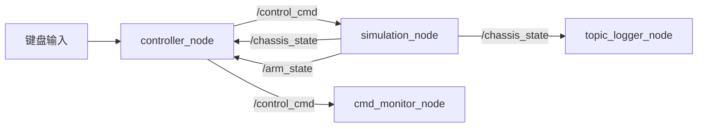
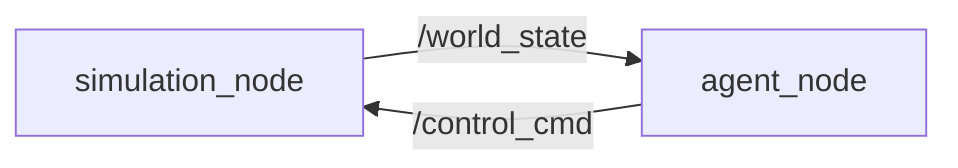
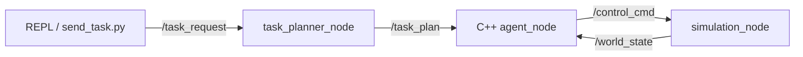
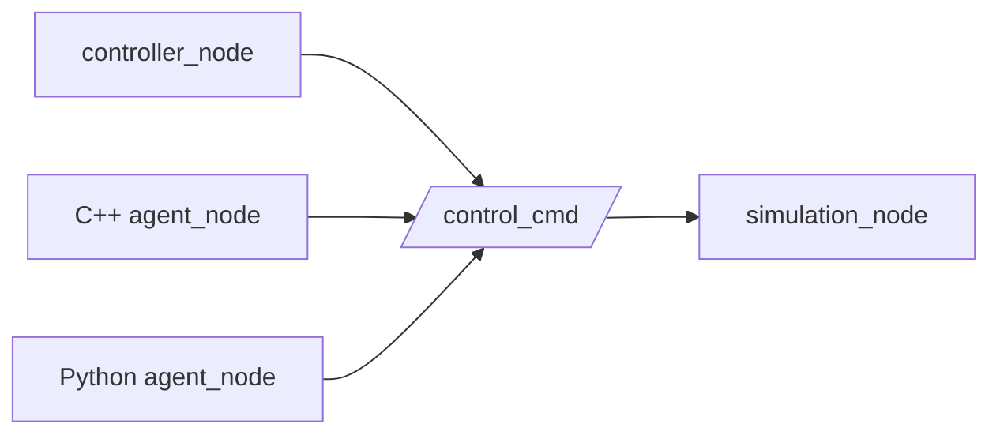

# ROS 2 节点与数据流

本文档描述项目当前主要 ROS 2 节点、Topic 和数据流。源码表示节点可能建立的通信关系；实际运行关系应以 `ros2 node list` 和 `ros2 topic info -v` 为准。

## 1. 节点清单

| 节点 | 实现包 | 主要职责 |
|---|---|---|
| `simulation_node` | `chassis_simulation` | 推进 MuJoCo 仿真、执行控制目标并发布机器人和环境状态 |
| `controller_node` | `chassis_controller` | 将键盘输入转换为底盘、机械臂和夹爪控制命令 |
| C++ `agent_node` | `chassis_agent_cpp` | 根据世界状态和任务目标运行 Brain/Skill，生成控制命令 |
| Python `agent_node` | `chassis_agent` | Python 自动控制实现，作为对照路径 |
| `task_planner_node` | `embodied_planner` | 将自然语言任务请求转换为结构化任务计划 |
| `cmd_monitor_node` | `learning_tools_cpp` | 订阅并节流输出 `/control_cmd` 的关键字段 |
| `topic_logger_node` | `learning_tools_cpp` | 订阅 `/chassis_state` 并输出底盘线速度 |

## 2. Topic 接口

| Topic | 消息类型 | 可能的发布者 | 可能的订阅者 | 数据性质 |
|---|---|---|---|---|
| `/control_cmd` | `embodied_msgs/msg/EmbodiedCommand` | `controller_node`、C++/Python `agent_node` | `simulation_node`、`cmd_monitor_node` | 高频控制命令 |
| `/chassis_state` | `nav_msgs/msg/Odometry` | `simulation_node` | `controller_node`、`topic_logger_node` | 高频底盘状态 |
| `/arm_state` | `sensor_msgs/msg/JointState` | `simulation_node` | `controller_node` | 高频关节状态 |
| `/world_state` | `embodied_msgs/msg/EmbodiedWorldState` | `simulation_node` | C++/Python `agent_node` | 高频世界状态 |
| `/task_request` | `std_msgs/msg/String` | REPL、任务发送脚本 | `task_planner_node` | 事件驱动的任务请求 |
| `/task_plan` | `embodied_msgs/msg/EmbodiedTaskPlan` | `task_planner_node` | C++ `agent_node` | 事件驱动的结构化计划 |

`/control_cmd`、`/chassis_state`、`/arm_state` 和 `/world_state` 的设计频率约为 50 Hz，实际频率以 `ros2 topic hz` 的运行结果为准。

## 3. 遥控控制闭环



键盘输入不是 ROS Topic。`controller_node` 将按键转换为 `EmbodiedCommand`，`simulation_node` 执行目标并发布实际状态。目标命令和实际状态不能混为一类数据。

## 4. 自动控制闭环



自动控制形成持续反馈闭环：

```text
观察世界 → 计算动作 → 执行动作 → 世界变化 → 再次观察
```

`/world_state` 是 Agent 的观察输入，`/control_cmd` 是动作输出。启动自动控制路径时，不应同时让遥控 Controller 发布控制命令。

## 5. Planner 任务链路



Planner 决定“做什么”，Agent/Brain/Skill 决定“如何通过连续动作完成任务”。`/task_plan` 是低频事件数据，`/control_cmd` 是高频控制数据。

`/task_plan` 使用深度 1、`reliable` 和 `transient_local` QoS，使后启动的订阅者可以收到最近的计划。接收方仍需考虑缓存任务是否已经过期。

## 6. 控制源约束



ROS 2 允许多个 Publisher 向 `/control_cmd` 发布，但项目目前没有控制仲裁器。运行时应只选择一个有效控制来源，否则可能发生：

- 不同来源的命令相互覆盖；
- 机器人运动抖动；
- 急停状态被后续命令覆盖；
- 行为不可复现，问题难以定位。

## 7. Service 接口

以下接口是短时请求/响应 Service，不属于 Topic 数据流：

| Service | 主要服务端 | 用途 |
|---|---|---|
| `/sim/reset_episode` | `simulation_node` | 重置仿真 episode |
| `/sim/set_virtual_grasp` | `simulation_node` | 设置虚拟抓取状态 |
| `/agent/reset_episode` | C++ `agent_node` | 重置 Agent episode 状态 |

## 8. 常用检查命令

```bash
ros2 node list
ros2 node info /simulation_node
ros2 topic list -t
ros2 topic info /control_cmd -v
ros2 topic echo /world_state --once
ros2 topic hz /world_state
```

命令用途：

- `node list`：确认哪些节点正在运行；
- `node info`：查看一个节点实际建立的发布、订阅和 Service 接口；
- `topic list -t`：查看 Topic 名称和消息类型；
- `topic info -v`：查看发布者、订阅者及 QoS；
- `topic echo --once`：抽样检查一条消息；
- `topic hz`：测量真实发布频率。

## 9. 第一周结论

- Node 是参与 ROS Graph 的计算单元，Topic 是异步多对多数据通道；
- 源码中的接口表示可能关系，运行中的 ROS Graph 才表示当前实际关系；
- 高频控制命令和状态数据应关注最新值与过期风险；
- 日志节流只减少日志输出，不降低 Topic 或回调频率；
- `/control_cmd` 适合连续控制数据，但需要明确唯一控制源；
- Planner、Agent 和 Simulation 分别承担任务规划、行为控制和身体/环境仿真职责。
